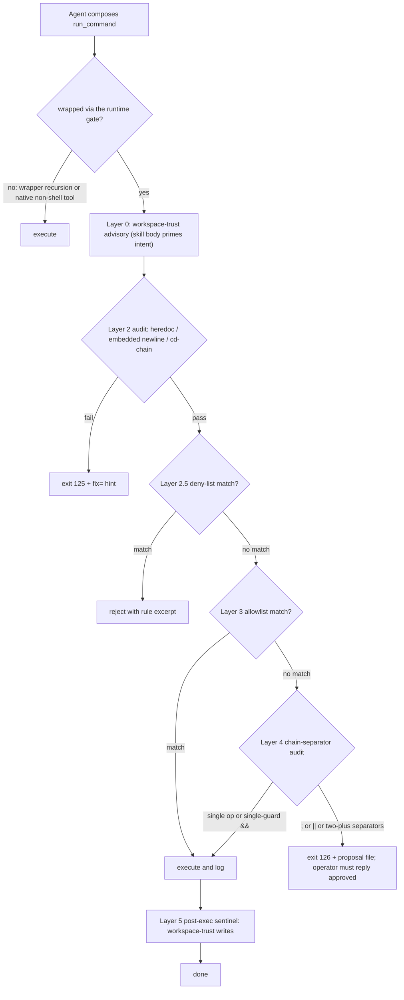

# break-check

[](https://skills.sh/weijia-89/break-check)

A pre-flight checklist plus an optional runtime wrapper that catches the
dozen shapes of terminal freeze, approval-dialog miss, and cross-agent
collision before they happen. Surf check before paddling out: the agent
runs the audit against the planned `run_command` line, and the line
either passes or gets reshaped before it ever hits the shell.

Multi-agent installable via the Vercel-Labs `skills` CLI:

```
npx skills add weijia-89/break-check
```

## Why this exists

I watched my coding agent freeze the IDE terminal three times in one
week before I decided to name the pattern. Each freeze had the same
shape underneath: a single shell line that looked harmless until I
cancelled the `run_command` and found the script had never been written
to disk. Other freezes in the same week had a heredoc that never closed
and a foreground watcher still holding stdin. The freezes were not
random; they fell into about a dozen shapes I could enumerate.

The skill body is that enumeration. The wrapper is the runtime gate that
fires when the enumeration is bypassed. The two together cost me about
an hour a week of approval-prompt friction, which is roughly the time I
used to lose to two or three freezes a week before the gate landed. I
think that math works out for any operator running an agent that
composes `run_command` lines at the cadence I do.

## What it does

The skill is a pre-flight checklist. Twelve numbered Tier-1 clauses
reject a planned command before it runs, and seven Tier-2 clauses catch
the shape of failure that survives a Tier-1 pass: output bombs,
parallel-agent lockfile contention, pager edge cases, that sort of
thing. The wrapper enforces the same discipline at runtime through five
mechanical layers and writes every invocation to an append-only history
log so the patterns that fire most often surface in calibration data.

Three failure modes recur when an LLM drives a shell on the operator's
behalf:

1. **Terminal freeze.** A heredoc, an unterminated `dquote`, a
   foreground watcher (`flutter run`, `tail -f`, `docker compose up`
   without `-d`), or a REPL invoked without `-c` leaves the IDE shell
   waiting on stdin that never arrives.
2. **Approval-dialog miss.** `Blocking: true` paired with a
   `WaitMsBeforeAsync` value outside the 3000–5000 ms band collides with
   the IDE's queueing and the approval prompt never renders.
3. **Cross-agent collision.** Two agent sessions sharing a working tree
   hit the same lockfile, migration, or build artifact and one silently
   corrupts the other.

The framing principle the skill rests on is from Anthropic's auto-mode
disclosure (users approved 93% of permission prompts) and the Penligent
*Sandboxes for Coding Agents* analysis: permission prompts are not a
durable security model. The skill treats the allowlist and the deny-list
inside the wrapper as friction-reduction infrastructure with no safety
claim, and rests the actual gate on chat-transcript review plus the
priming language in the skill body for agent intent.

## Architecture



Layer numbering is the wrapper's internal scheme, exposed in the
reference implementation and the per-PID diagnostic files at
`/tmp/safe-cmd.<pid>.{log,meta,proposal}`. Layer 0 is advisory only (no
runtime gate; the skill body prompts the agent to surface before writing
to workspace-trust paths). Layers 2 through 5 are mechanical gates with
structured exit codes.

## Exit codes (reference implementation)

| Code | Meaning | Recovery |
|---|---|---|
| 0 | underlying command succeeded | continue |
| 1–99 | underlying command failed | read the meta + log, fix the underlying error |
| 124 | timeout (SIGKILL after the configured limit) | read the log tail, pick a faster strategy or detach via a long-job workflow |
| 125 | Layer 2 audit failed (heredoc, embedded newline, or cd-chain) | apply the `fix=` field rewrite from the per-PID meta file |
| 126 | Layer 4 chain proposal (multi-op chain requires operator approval) | read the proposal file, surface command + reason to the operator, wait for explicit "approved" before retry |

## When to invoke

Always. The frontmatter declares `always_on` discovery. Every
`run_command` that reaches a shell is in scope.

## When to skip

There is no skip mode. The wrapper has two narrow non-applicability
exceptions:

- the wrapper invocation itself (recursion avoidance)
- agent-native tool calls that do not reach a shell (`read_file`,
  `grep_search`, `find_by_name`, `edit`, `write_to_file`, `view_file`,
  `list_dir`)

A command that feels too small to wrap is exactly the case where the
rationalization surface is appearing, and the wrap remains mandatory in
that situation.

## What this skill protects against

The pattern this skill catches is composition by reflex. An agent chains
`cmd1 && cmd2 && cmd3` because each piece individually feels tiny enough
to combine; the chain freezes at the second `&&` when the first command
waits on stdin that never arrives. Same root cause when an agent inlines
a heredoc body it considers "only five lines long," or leaves
`flutter run` in the foreground because the job is supposedly quick.
Each individual rationalization feels harmless at the moment of
composition, and the cumulative effect every time is the operator's work
stops until someone manually unsticks the terminal.

The skill also catches a deferred-execution class the wrapper alone
cannot reach. Writes to workspace-trust files (`.git/hooks/*`,
`.github/workflows/*`, `~/.zshrc`, agent rule and skill paths) manifest
later, when a human or CI runs the affected artifact, so the damage
window is not the moment of the write. The Layer 0 advisory in the
skill body asks the agent to surface intent before the write; the
Layer 5 sentinel emits an audit record after the write so the operator
catches escapes in the chat transcript.

## Composes with

- An orchestrator skill that loads `break-check` at session start and
  stays out of the per-wrap decisions
- A standing rule for spawning long jobs and reporting them honestly
  (the wrapper assumes the operator has a long-job workflow available
  for the >2 minute case)
- An optional runtime wrapper. The reference implementation lives at
  [github.com/weijia-89/safe-terminal](https://github.com/weijia-89/safe-terminal)
  under `scripts/safe-cmd.sh`

## Files

- `SKILL.md`, the canonical body (Tier 1, Tier 2, Allowed / Banned,
  wrapper documentation, workspace-trust allergens, known incident
  patterns, residual risk classes)
- `CHANGELOG.md`, version history with per-edit rationale
- `ROADMAP.md`, named follow-ons and out-of-scope items
- `metadata.json`, skills.sh leaderboard metadata
- `LICENSE`, MIT

## Reference implementation pointer

`break-check` ships the skill body and metadata only. The runtime
wrapper (`safe-cmd.sh`) lives in a sibling project at
[github.com/weijia-89/safe-terminal](https://github.com/weijia-89/safe-terminal),
where it sits alongside an allowlist seeder, a deny-list seeder, a test
suite, and the operator-specific configuration shape my own laptop uses.
Operators wanting the runtime gate clone `safe-terminal`, copy
`scripts/safe-cmd.sh` into their bin directory, and adapt the path
assumptions to their environment.

The two repos exist on purpose. `break-check` is the env-agnostic skill
body that installs cleanly across the agents skills.sh supports
(Windsurf, Claude Code, Cursor, Codex, Gemini CLI, and others).
`safe-terminal` is the operator-specific bundle that includes the
wrapper plus the local sync helpers (`scripts/bundle.sh`,
`scripts/verify_safe_terminal_sync.sh`) for keeping the canonical body
synchronized to the agent's on-disk rule paths.

## License

MIT. See `LICENSE`.
